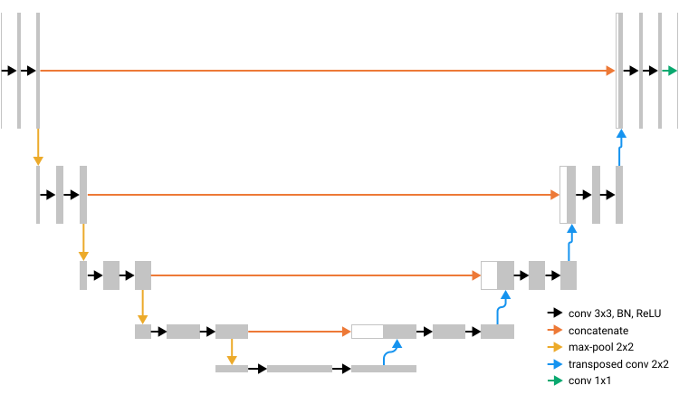
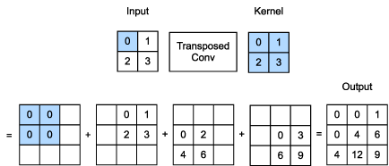
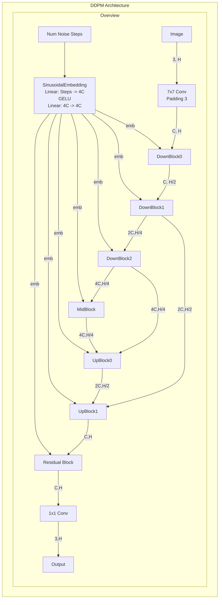
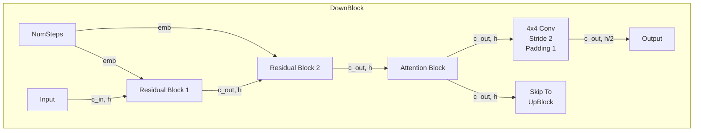
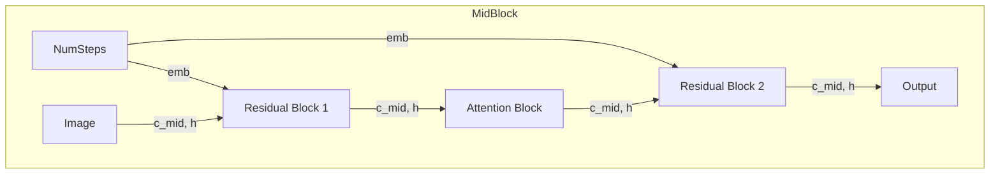
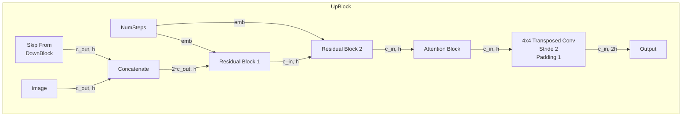
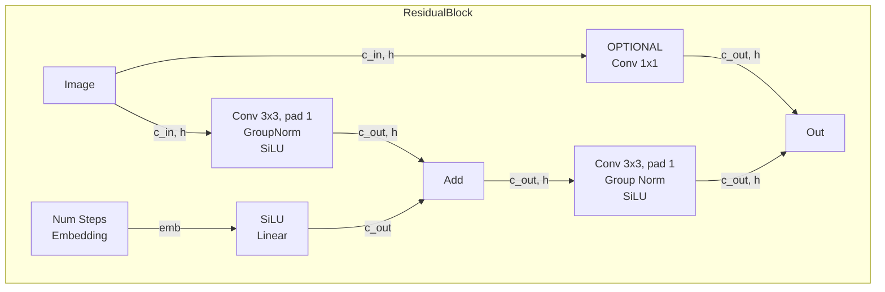
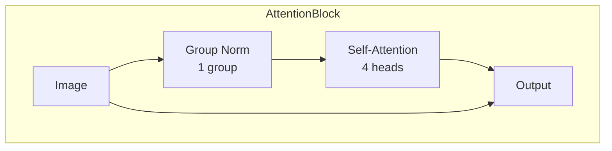
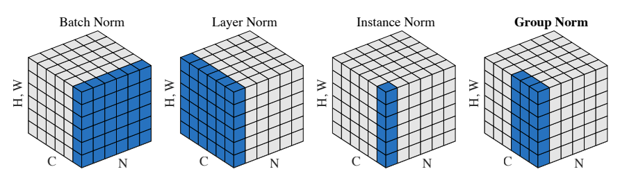

# W3D4 part 2 -  The DDPM Architecture

The DDPM paper uses a custom architecture which is based on the PixelCNN++ paper with some modifications, which is in turn based on a couple other papers (U-Net and Wide ResNet) which are in turn modified versions of other papers. For today, just follow along with the diagrams and we won't worry if we exactly match the paper as long as it works.

## Table of Contents

- [The U-Net](#the-u-net)
- [The DDPM Model](#the-ddpm-model)
- [Downsampling Block](#downsampling-block)
- [The MidBlock](#the-midblock)
- [The UpBlock](#the-upblock)
- [Residual Block](#residual-block)
- [Attention Block](#attention-block)
- [Group Normalization](#group-normalization)
- [Sinusoidal Positional Embeddings](#sinusoidal-positional-embeddings)
- [Sigmoid Linear Unit](#sigmoid-linear-unit)
- [Self-Attention with Two Spatial Dimensions](#self-attention-with-two-spatial-dimensions)
- [Transposed Conv2d](#transposed-convd)
- [Assembling the UNet](#assembling-the-unet)

## The U-Net

At the high level, the shape of this network resembles the U-Net architecture, pictured below. Like ResNet, U-Net is mostly composed of convolutional layers, but whereas ResNets were developed for classifying an image as a whole, U-Net was developed for medical segmentation tasks where the goal is to predict an output class such as "this is part of a tumour" for each input pixel in the image. This means that the network has to both get an understanding of the global structure of the image like ResNet does, but also have the ability to make fine-grained predictions at the pixel level.

<p align="center">
    
</p>

In the diagram, the grey rectangles represent tensors with the height of the rectangle being the height (and width) of the image tensor and the width of the rectangle being the number of channels.

The network is conceptually divided into three parts: the downsampling part, the middle part, and the upsampling part. In the downsampling part starting on the left of the diagram, we do some convolutions and then the yellow downsampling operation halves the width and height. The number of channels increases throughout the downsampling part, but since the spatial dimensions are shrinking, the compute per layer stays similar.

The middle section is just a couple more convolutions, and then we go into the upsampling part. In these layers, we actually double the spatial dimensions using a transposed convolution. A transposed convolution is also called a deconvolution, but deconvolution can also refer to something different so it's less ambiguous to use the name "transposed convolution".

Like a regular convolution, a transposed convolution uses a sliding kernel, but the difference is that the output is larger than the input. Fun fact: a transposed convolution is closely related to the backwards pass of a regular convolution.

<p align="center">
    
</p>

At the end, a final convolution takes us down to the desired number of output channels. In the medical segmentation case, this might be one channel for each class of tumour that you want to detect. In our case, we're going to have three output channels to predict a RGB image.

## The DDPM Model

The model used in the DDPM is shown below and has the same three part structure as the U-Net: at first the spatial dimensions half and the channels double, and then the spatial dimensions double and channels are concatenated. It's common to still call this a U-Net and name the class `Unet` because it has this basic shape, even though the majority of components have been modified from the original U-Net.

We've got some 2D self-attention in there, new nonlinearities, group normalization, and sinusoidal position embeddings. We'll implement these from scratch so you understand what they are. Once you've done that, assembling the network will be routine work for you at this point.

One complication is that in addition to taking a batch of images, for each image we also have a single integer representing the number of steps of noise added. In the paper, this ranges from 0 to 1000, so the range is too wide to directly pass this as an integer. Instead, these get embedded into a tensor of shape `(batch, emb)` where `emb` is some embedding dimension and passed into the blocks.

This is going to be the most complicated architecture you've done so far, but the good news is that if you don't do it exactly right, it'll probably still work fine.




## Downsampling Block

This block takes some input height `h` and returns two things: a skip output of height `h` that connects to a later `UpBlock`, and a downsampled output of height `h//2`. We are going to assume (and it's good practice to assert inside the code) that h is always going to be divisible by 2.



## The MidBlock

After the DownBlocks, the image is passed through a MidBlock which doesn't change the number of channels.




## The UpBlock

Note here that the first upsampling block takes a skip connection from the last downsampling block, and the second upsampling block takes a skip connection from the second last downsampling block. In your implementation, pushing and popping a stack is a clean way to handle this. The indicated sizes `c_in` and `c_out` are with respect to the source downsampling block, which is confusing but so is notating it the other way.




## Residual Block

These are called residual blocks because they're derived from but not identical to the ResNet blocks. You can see the resemblance with a main branch and a residual branch. When the input dimensions don't match the output dimensions, the residual branch uses a 1x1 convolution to keep them consistent.



## Attention Block


Let's get started with the new low-level components, and then we'll build bottom-up to the full architecture.


```python
from typing import Optional, Union
import matplotlib.pyplot as plt
import torch as t
from einops import rearrange, repeat
from fancy_einsum import einsum
from torch import nn
import w3d4_test
from w3d4_part1_diffusion_training_solution import DiffusionModel

MAIN = __name__ == "__main__"

```

## Group Normalization

In Layer Normalization, we computed a mean and standard deviation for each training example, across all channels (channels are the same as embedding dimensions in a transformer).

Group Normalization means we divide our channels into some number of groups, and we have a mean and standard devication for each training example AND group. When the number of groups is 1, GroupNorm can be expressed as a LayerNorm. The main difference is that GroupNorm expects the channel dimension right after the batch dimension, as is conventional in PyTorch for image data. LayerNorm expects the channel (embedding) dimension to be last, as is conventional in PyTorch for NLP.

<p align="center">
    
</p>

The pixels in blue are normalized by the same mean and standard deviation. For group norm, two groups are depicted.

For more intuition behind why this could be a good alternative to other normalization schemes, see the [Group Normalization](https://arxiv.org/pdf/1803.08494.pdf) paper.

Implement `GroupNorm` so it behaves identically to `torch.nn.GroupNorm` given a `(batch, channels, height, width)` tensor. While `torch.nn.GroupNorm` supports more than 2 spatial dimensions, you don't need to worry about this.

<details>

<summary>Help! I'm confused about the forward pass!</summary>

Use `rearrange` to introduce a 5th group dimension and then compute the mean and variance over the appropriate dimensions. After you subtract and divide the mean and variance, `rearrange` again back into BCHW before applying the learnable parameters.

</details>


```python
class GroupNorm(nn.Module):
    def __init__(
        self,
        num_groups: int,
        num_channels: int,
        eps: float = 1e-05,
        affine: bool = True,
        device: Optional[Union[t.device, str]] = None,
        dtype: Optional[t.dtype] = None,
    ) -> None:
        pass

    def reset_parameters(self) -> None:
        """Initialize the weight and bias, if applicable."""
        if self.affine:
            nn.init.ones_(self.weight)
            nn.init.zeros_(self.bias)

    def forward(self, x: t.Tensor) -> t.Tensor:
        """Apply normalization to each group of channels.

        x: shape (batch, channels, height, width)
        out: shape (batch, channels, height, width)
        """
        pass


if MAIN:
    w3d4_test.test_groupnorm(GroupNorm, affine=False)
    w3d4_test.test_groupnorm(GroupNorm, affine=True)

```

## Sinusoidal Positional Embeddings

In GPT and BERT, the mapping from the integer position to embedding vector was learned by the network during training. It's also common practice to just hardcode this mapping using a combination of sine and cosine functions with different frequencies. The argument for doing this is that it slightly reduces the number of parameters in the network, and it seems to work just as well.

In our network, the equivalent of position index is the number of noise steps added. The network needs this information to "know" how much noise to expect, because the amount of noise is increasing with the number of steps.

For more intuition about why we use sine and cosine functions, see [this blog post](https://kazemnejad.com/blog/transformer_architecture_positional_encoding/). The short version is that it allows a simple linear transformation in the query and key matrices to express "this head attends to information k positions ago".

Implement the positional embedding, then reproduce Figure 2 and Figure 3 from the above blog post. Note that the equations in the blog post are confusing (in particular, it doesn't define what "k" is). I strongly suggest using the equations under the "Positional Encoding" section of [this other blog post](https://medium.com/dissecting-bert/dissecting-bert-part-1-d3c3d495cdb3) instead.

Exercise: does the order of the dimensions (channels) in the positional embedding matter?

<details>

<summary>Solution - Order of Dimensions</summary>

If we wanted to load pretrained weights, we would need to match the order that the model was trained with. Training from scratch like today, most operations compute channel-wise and then sum, so if we permuted the order of channels and also permuted the weights, the output would be identical.

You've just learned about group normalization which does in fact group adjacent channels together, so it would matter if we were applying group normalization to the embedding. But we don't have to worry about this today and you can make your dimensions in any order you like.

</details>


<details>

<summary>Help! I'm confused about the implementation!</summary>

There are `embedding_size//2` different frequencies $w_k$ that can be pre-computed in the constructor because they only depend on the embedding size. Register these as a buffer so that they'll be moved to the appropriate device automatically.

In forward, form the outer product of x and $w_k$, and then call sin and cos to produce the two halves of the output. To interleave the frequencies like in the article, you can `stack` and then `rearrange`, but it's equally valid to just concatenate them and have all the sin terms followed by all the cos terms.

</details>


```python
class SinusoidalPositionEmbeddings(nn.Module):
    def __init__(self, embedding_size: int):
        pass

    def forward(self, x: t.Tensor) -> t.Tensor:
        """
        x: shape (batch, ) - for each batch element, the number of noise steps
        Out: shape (batch, embedding_size)
        """
        pass


if MAIN:
    "TODO: YOUR CODE HERE"

```

## Sigmoid Linear Unit

The Sigmoid Linear Unit (SiLU) nonlinearity is just elementwise `x * sigmoid(x)`. Confusingly, this function is also called Swish in the literature - these two names refer to exactly the same thing. Implement the function and plot it on the interval [-5, 5]. Like every other new non-linearity published, its authors claim that it has superior performance on benchmarks, but we don't fully understand why.

For more on this activation function, see [Swish: A Self-Gated Activation Function](https://arxiv.org/pdf/1710.05941v1.pdf).


```python
def swish(x: t.Tensor) -> t.Tensor:
    pass


class SiLU(nn.Module):
    def forward(self, x: t.Tensor) -> t.Tensor:
        return swish(x)


if MAIN:
    "TODO: YOUR CODE HERE"

```

## Self-Attention with Two Spatial Dimensions

In the transformer, we had one spatial (sequence) dimension, but now we have image data with both height and width (which we're assuming to be equal). Implement the code for this - feel free to refer to your previous self-attention implementation.

<details>

<summary>Help! I'm confused about how to handle both spatial dimensions!</summary>

The most straightforward way to adapt a previous implementation is start by using `rearrange` to merge height and width into one sequence dimension, and then finish by using `rearrange` again to split the sequence dimension back out.

Another way is to use 1x1 `Conv2d` instead of `Linear` layers, since these will automatically operate two spatial dimensions.

</details>


```python
class SelfAttention(nn.Module):
    def __init__(self, channels: int, num_heads: int = 4):
        """Self-Attention with two spatial dimensions.

        channels: the number of channels. Should be divisible by the number of heads.
        """
        pass

    def forward(self, x: t.Tensor) -> t.Tensor:
        """
        x: shape (batch, channels, height, width)
        out: shape (batch, channels, height, width)
        """
        pass


if MAIN:
    w3d4_test.test_self_attention(SelfAttention)

```

## Transposed Conv2d

You've already implemented the regular Conv2d, and the transposed version is along the same lines. We'll leave this to the bonus section in the interest of saving time. If you feel confused about what this operation does, skimming through Chapter 4 of [A guide to convolution arithmetic for deep learning](https://arxiv.org/pdf/1603.07285v1.pdf) and looking at the pictures should help to clarify.


```python
ConvTranspose2d = nn.ConvTranspose2d

```

## Assembling the UNet

Implement the various blocks according to the diagram.


```python
class AttentionBlock(nn.Module):
    def __init__(self, channels: int):
        pass

    def forward(self, x: t.Tensor) -> t.Tensor:
        pass


if MAIN:
    w3d4_test.test_attention_block(SelfAttention)


class ResidualBlock(nn.Module):
    def __init__(self, input_channels: int, output_channels: int, step_dim: int, groups: int):
        """
        input_channels: number of channels in the input to foward
        output_channels: number of channels in the returned output
        step_dim: embedding dimension size for the number of steps
        groups: number of groups in the GroupNorms

        Note that the conv in the left branch is needed if c_in != c_out.
        """
        pass

    def forward(self, x: t.Tensor, time_emb: t.Tensor) -> t.Tensor:
        """
        Note that the output of the (silu, linear) block should be of shape (batch, c_out). Since we would like to add this to the output of the first (conv, norm, silu) block, which will have a different shape, we need to first add extra dimensions to the output of the (silu, linear) block.
        """
        pass


if MAIN:
    w3d4_test.test_residual_block(ResidualBlock)


class DownBlock(nn.Module):
    def __init__(self, channels_in: int, channels_out: int, time_emb_dim: int, groups: int, downsample: bool):
        pass

    def forward(self, x: t.Tensor, step_emb: t.Tensor) -> tuple[t.Tensor, t.Tensor]:
        """
        x: shape (batch, channels, height, width)
        step_emb: shape (batch, emb)
        Return: (downsampled output, full size output to skip to matching UpBlock)
        """
        pass


if MAIN:
    w3d4_test.test_downblock(DownBlock, downsample=True)
    w3d4_test.test_downblock(DownBlock, downsample=False)


class UpBlock(nn.Module):
    def __init__(self, dim_in: int, dim_out: int, time_emb_dim: int, groups: int, upsample: bool):
        """
        IMPORTANT: arguments are with respect to the matching DownBlock.

        """
        pass

    def forward(self, x: t.Tensor, step_emb: t.Tensor, skip: t.Tensor) -> t.Tensor:
        """ """
        pass


if MAIN:
    w3d4_test.test_upblock(UpBlock, upsample=True)
    w3d4_test.test_upblock(UpBlock, upsample=False)


class MidBlock(nn.Module):
    def __init__(self, mid_dim: int, time_emb_dim: int, groups: int):
        pass

    def forward(self, x: t.Tensor, step_emb: t.Tensor):
        pass


if MAIN:
    w3d4_test.test_midblock(MidBlock)


class Unet(DiffusionModel):
    def __init__(
        self,
        image_shape: tuple[int, int, int],
        channels: int = 128,
        dim_mults: tuple[int, ...] = (1, 2, 4, 8),
        groups: int = 4,
        max_steps: int = 1000,
    ):
        """
        image_shape: the input and output image shape, a tuple of (C, H, W)
        channels: the number of channels after the first convolution.
        dim_mults: the number of output channels for downblock i is dim_mults[i] * channels. Note that the default arg of (1, 2, 4, 8) will contain one more DownBlock and UpBlock than the DDPM image above.
        groups: number of groups in the group normalization of each ResnetBlock (doesn't apply to attention block)
        max_steps: the max number of (de)noising steps. We also use this value as the sinusoidal positional embedding dimension (although in general these do not need to be related).
        """
        self.noise_schedule = None
        self.img_shape = image_shape
        pass

    def forward(self, x: t.Tensor, num_steps: t.Tensor) -> t.Tensor:
        """
        x: shape (batch, channels, height, width)
        num_steps: shape (batch, )

        out: shape (batch, channels, height, width)
        """
        pass


if MAIN:
    w3d4_test.test_unet(Unet)

```