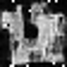
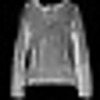
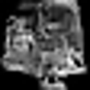

# Training U-Net on FasionMNIST

We've already got most of the pieces in place, so setting up this training should be straightforward.

## Table of Contents

- [Dataset Loading](#dataset-loading)
- [Model Creation](#model-creation)
- [Troubleshooting](#troubleshooting)
- [Evaluating and Comparing Generative Models](#evaluating-and-comparing-generative-models)
    - [Inception Score](#inception-score)
    - [Limitations of the Inception Score](#limitations-of-the-inception-score)
    - [Frechet Inception Distance](#frechet-inception-distance)
- [Bonus](#bonus)
    - [Improving the Diffusion Model](#improving-the-diffusion-model)
    - [Breaking the IS and FID Metrics](#breaking-the-is-and-fid-metrics)
    - [Implement your own IS and FID Metrics](#implement-your-own-is-and-fid-metrics)


```python
import os
from pathlib import Path
from typing import Any
import numpy as np
import torch as t
import torchvision
from einops import rearrange, repeat
from IPython.display import display
from PIL import Image
from scipy import linalg
from torch import nn
from torch.utils.data import DataLoader, TensorDataset
from torchvision import datasets, transforms
from torchvision.transforms import CenterCrop, Compose, Lambda, RandomHorizontalFlip, Resize, ToPILImage, ToTensor
from tqdm.auto import tqdm
from w3d4_part1_diffusion_training_solution import NoiseSchedule, sample, train
from w3d4_part2_unet_solution import Unet

device = "cuda" if t.cuda.is_available() else "cpu"
MAIN = __name__ == "__main__"
IS_CI = os.getenv("IS_CI")


def make_transform(image_size=128):
    """Pipeline from PIL Image to Tensor."""
    return Compose([Resize(image_size), CenterCrop(image_size), ToTensor(), Lambda(lambda t: t * 2 - 1)])


def make_reverse_transform():
    """Pipeline from Tensor to PIL Image."""
    return Compose(
        [
            Lambda(lambda t: (t + 1) / 2),
            Lambda(lambda t: t.permute(1, 2, 0)),
            Lambda(lambda t: t * 255.0),
            Lambda(lambda t: t.clamp(0, 255)),
            Lambda(lambda t: t.numpy().astype(np.uint8)),
            ToPILImage(),
        ]
    )

```

We're going to start by thinking about the input distribution of images. [FashionMNIST](https://github.com/zalandoresearch/fashion-mnist) is a dataset of 60K training examples and 10K test examples that belong to one of 10 different classes like "t-shirt" or "sandal". Each image is 28x28 pixels and in 8-bit grayscale. We think of those dataset examples as being samples drawn IID from some larger input distribution "the set of all FashionMNIST images".


###Image Processing

The first thing we need is an input image $x_0$. to experiment on. We'll use everyone's favorite experimental animal, the guinea pig. We'll follow the paper in scaling the pixel data to [-1, 1].


```python
if MAIN:
    transform = make_transform()
    reverse_transform = make_reverse_transform()
    image = Image.open("./clip_images/guineapig_cucumber.jpg")
    x = transform(image)
    display(image)

```

## Dataset Loading


```python
def get_fashion_mnist(train_transform, test_transform) -> tuple[TensorDataset, TensorDataset]:
    """Return MNIST data using the provided Tensor class."""
    mnist_train = datasets.FashionMNIST("../data", train=True, download=True)
    mnist_test = datasets.FashionMNIST("../data", train=False)
    print("Preprocessing data...")
    train_tensors = TensorDataset(
        t.stack([train_transform(img) for (img, label) in tqdm(mnist_train, desc="Training data")])
    )
    test_tensors = TensorDataset(t.stack([test_transform(img) for (img, label) in tqdm(mnist_test, desc="Test data")]))
    return (train_tensors, test_tensors)


if MAIN and (not IS_CI):
    train_transform = Compose([ToTensor(), RandomHorizontalFlip(), Lambda(lambda t: t * 2 - 1)])
    data_folder = Path("data/w3d4")
    data_folder.mkdir(exist_ok=True, parents=True)
    DATASET_FILENAME = data_folder / "generative_models_dataset_fashion.pt"
    if DATASET_FILENAME.exists():
        (train_dataset, test_dataset) = t.load(str(DATASET_FILENAME))
    else:
        (train_dataset, test_dataset) = get_fashion_mnist(train_transform, train_transform)
        t.save((train_dataset, test_dataset), str(DATASET_FILENAME))

```

## Model Creation

Now, set up training, using your implemenations of UNet and calling the training loop from part 1.


```python
if MAIN and (not IS_CI):
    config_dict: dict[str, Any] = dict(
        model_channels=28,
        model_dim_mults=(1, 2, 4),
        image_shape=(1, 28, 28),
        max_steps=200,
        epochs=10,
        lr=0.001,
        batch_size=128,
        img_log_interval=400,
        n_images_to_log=3,
        device=t.device("cuda") if t.cuda.is_available() else t.device("cpu"),
    )
    ...

```

## Troubleshooting

<summary>My generated images have a bunch of random white pixels on them!</summary>

<details>

If they look like this:

<p align="center">
    
</p>

This could indicate that you're adding too much noise near the end of the diffusion process. Check your equations again, in particular that you're not missing a square root anywhere - $\sigma^2$ represents variance and you might be needing a standard deviation instead.

</details>

<summary>Ok, what are they "supposed" to look like?</summary>

<details>

Some of mine look like this, but your mileage may vary:

<p align="center">
    </img
</p>

Others look like this:

<p align="center">
    </img
</p>


</details>


```python
if MAIN and (not IS_CI):
    with t.inference_mode():
        samples = sample(model, n_samples=10)
    assert isinstance(samples, t.Tensor)
    print("Generated images: ")
    for s in samples:
        img = reverse_transform(s.cpu())
        display(img.resize((4 * 28, 4 * 28)))
    print("Training images: ")
    (xs,) = train_dataset[:5]
    for x in xs:
        display(reverse_transform(x).resize((4 * 28, 4 * 28)))
if MAIN and (not IS_CI):
    with t.inference_mode():
        samples = sample(model, n_samples=1, return_all_steps=True)
    print("Printing sequential denoising: ")
    for i, s in enumerate(samples):
        if i % (len(samples) // 20) == 0:
            print("Step ", i)
            img = reverse_transform(s[0].cpu())
            display(img.resize((4 * 28, 4 * 28)))

```

## Evaluating and Comparing Generative Models

At this point, you may be wondering how to quantify how good your model is. In supervised learning, it's conceptually clear what we're after: we want our classifier to have high accuracy on future unseen data that comes from the same distribution as the training set. It's also clear what we can do in practice to measure this: a held-out test set is the gold standard. To the extent that the held-out test set is really held out, the test distribution is really the same, and the test labels are actually correct then this is a pretty reasonable proxy for the thing we care about.

In generative models it's much less clear on both the conceptual level and on the practical level what makes a model "good".

One goal you could care about is to fit the data distribution $p(x)$, a task which is called "density estimation". In this framing, a model is good if it can accurately assign a likelihood to each possible input image. We would then expect that our model assigns high likelihood to points in the training set and also on an IID held-out set, and low likelihood to points that really don't belong in the data distribution like random noise or pictures of other objects. This is captured in the "NLL Test" and "NLL Train" metrics reported in Table 1. In fact we started out in Equation 3 by trying to minimize the negative log likelihood of the training set, which is equivalent to maximizing the likelihood of the training set. Equation 12 still has the same objective, but then a plot twist occurs: the authors decided to abandon the objective because the other thing was "beneficial to sample quality".

What even is "sample quality"? On the conceptual level, we could say the samples have high visual quality if:

- The generated images contain clear and identifiable objects and don't have more noise, blurriness, or other artifacts that aren't present in real training images.
- The generated images cover all the "modes" or distinct clusters in the training set. For example on MNIST, the model should be able to generate every digit, and it should generate the digit 4 in both of the common ways.

How do we measure it? We could pay some humans to use their judgement in some way, but that's expensive so usually "sample quality" refers to using automated metrics to try and capture the notion of quality. The authors report two common metrics: Inception Score (IS) and Frechet Inception Distance (FID). Let's dig into these.

### Inception Score

Inception Score is a popular automated metric that claims to measure both aspects of visual quality mentioned above. The name Inception refers to a specific neural network for image classification called Inception v3. Inception v3 is a convolutional network with around 25 million parameters. A particular set of weights had a competitive 78% accuracy on ImageNet in 2015 when it was published. (As of 2022, state of the art is over 90% accuracy on ImageNet, so it's fair to say that this model is now considered awful).

To calculate the Inception Score, you generate N samples $x$ where N is traditionally 5000, resize them to the Inception Score network's input size of 299x299, and run the forward pass to obtain a probability distribution over the 1000 ImageNet classes $p(y|x)$. The claim is that this label distribution $p(y|x)$ will have low entropy (probability will be concentrated on only a few classes) if the network is confident that this is a sharp, clear picture of an object, and it will have high entropy (closer to a uniform distribution) if the image is blurry and unrecognizable to the network.

The second claim is that if we sum over the samples to obtain $p(y)$, this will have higher entropy if the samples cover a diverse range of objects than if all the samples look very similar.

The final score is computed using the KL divergence as: $exp(1/N D_{KL}(p(y|x) || p(y)))$. If the first term is low entropy and the second term is high entropy, the divergence will be larger so a higher Inception Score is better. The DDPM paper follows the common practice of computing the IS ten times with 5000 samples each time and reporting the mean and standard deviation.

### Limitations of the Inception Score

Take a couple minutes to form an opinion on how meaningful the Inception Score is. Does this capture what we care about in a valid, reproducible way?

<details>

<summary>Spoiler - My Take on Inception Score</summary>

Conceptually, I think that Inception Score is reasonable if you're trying to generate ImageNet images, but basically meaningless beyond that. The 1000 ImageNet classes don't map really at all to FashionMNIST's 10 classes, and the image resolution and grayscale versus color is also way out of distribution for the Inception v3, so I wouldn't expect the output to be particularly meaningful.

It even seems a stretch to me to report this on CIFAR-10, given that that dataset is also very different from ImageNet.

It also seems like given the rate of progress in vision, using a more recent model would give more meaningful results and we're only using this old model in order to compare to published values in the literature.

The paper [A Note on the Inception Score](https://arxiv.org/pdf/1801.01973.pdf) has a detailed critique covering more issues with Inception Score as it's used in the research community.

</details>

### Frechet Inception Distance

The DDPM authors also report the Frechet Inception Distance (FID) metric, which was proposed to improve upon Inception Score. FID is still using the same Inception v3, but instead of the output class distributions, we look at the distribution of activations just before the final layer.

We fit a multivariate Gaussian to the distribution of activations on a sample from the training set, and a second multivariate Gaussian to the activations on a sample from the generator.

The idea is that these two distributions will be close if the generated images are similar in Inception v3 feature space. Since this feature space contains all the information needed for classification, the claim is that this measures perceptual similarity and a lower distance should be better. Do you buy this claim?

## Bonus

Congratulations on completing the day's content!

### Improving the Diffusion Model

As you've seen, it's challenging to determine if a change to your generative model actually is an improvement to the "thing we care about". Try to improve your model nonetheless using more recent advances in diffusion models. Some ideas are:

- Do a hyperparameter search to find improved sample quality
- Try using different loss functions (l1_loss, smooth_l1_loss) and see how this changes the samples.
- Try training on CIFAR10
- Try to speed up the sampling while preserving sample quality
- Try to find a more valid automated metric to measure sample quality.

### Breaking the IS and FID Metrics

See if you can do things that don't materially affect the (human-perceived) sample quality, but actually significantly change the metrics for better or for worse.
    - For example, what happens if you save your generated images as JPEG and then reload them, at various compression levels?
    - Can you do an adversarial attack on Inception by slightly modifying the image in the direction of some gradient to affect the metrics?

Try to come up with your own ideas, but feel free to refer to the papers if you're stuck.

For a reference implementation of these metrics, see [torch-fidelity](https://github.com/toshas/torch-fidelity).

### Implement your own IS and FID Metrics

Implement the Inception Score using the [definition of KL divergence](https://en.wikipedia.org/wiki/Kullback%E2%80%93Leibler_divergence).

A good way to know if your algorithm is correct is to compute it for a training set where the correct values are known, and/or compare to the reference algorithm above.

You can also try running your metrics on images generated at various points during training. Do the metrics trend in the direction you would expect if they did correlate with sample quality?

**Note that anything below is a starting point, the solutions are not guaranteed to be correct**
